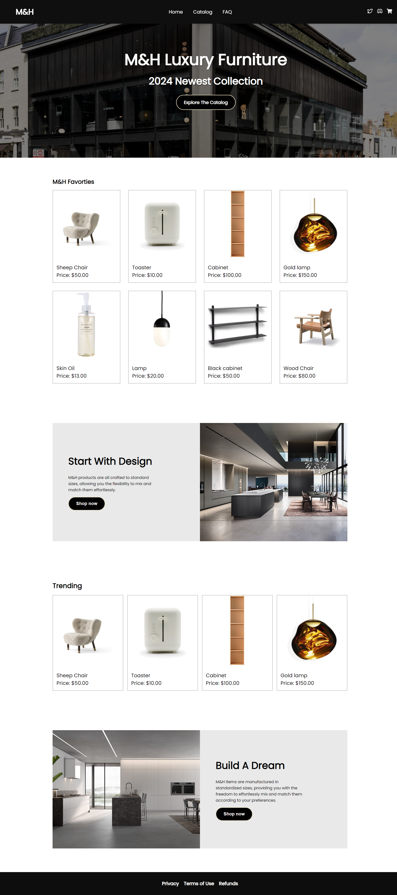
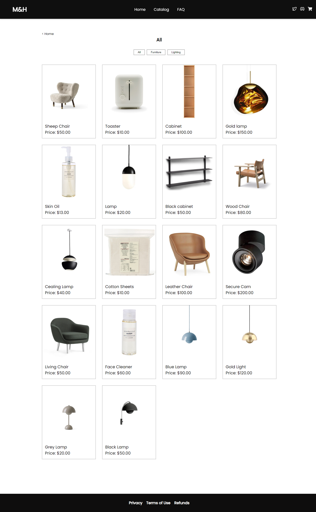
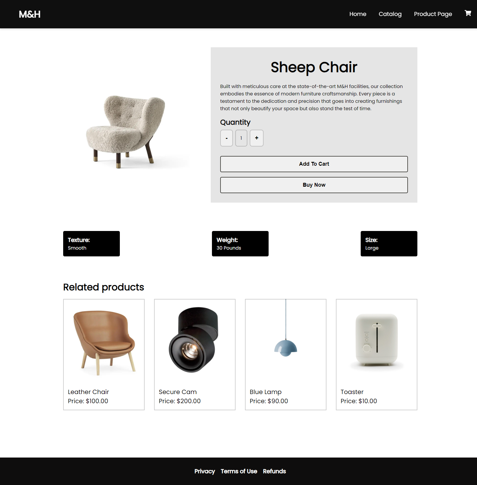
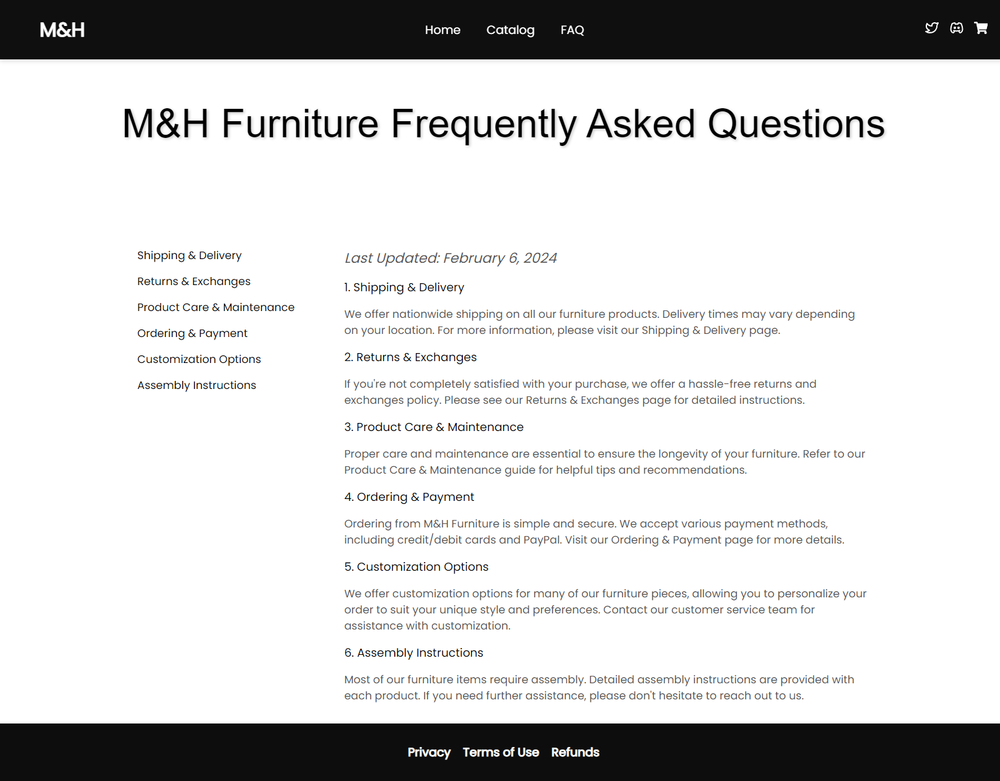

<h2>About the project</h2>

 

        The project leveraged advanced React capabilities, particularly React Context, to create a shopping cart feature, thereby enhancing the dynamics of the user interface. Interactive features and dynamic content were engineered using React components, ensuring seamless navigation and engagement for users across diverse devices and browsers. Furthermore, strategic implementation of lazy loading images was employed to improve site performance and user engagement, ultimately contributing to a smoother browsing experience overall. These efforts were aimed at elevating user interaction and satisfaction within the platform.
      

👉 Live Demo: <a href='https://mhfurniture.vercel.app'>M&H Demo</a>

<h3>Built using:</h3>

» React JS  
» JS  
» CSS  
» HTML 

 

<h2>Project Screenshots</h2>
 
<h3 align='center'>Home Page 🏠</h3>

  

  

<h3 align='center'>Catalog Page 🎁</h3>

  

  
<h3 align='center'>Product Page 👝</h3>

  

  
<h3 align='center'>FAQ Page 🕯️</h3>

  

