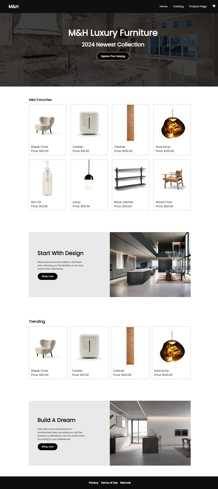
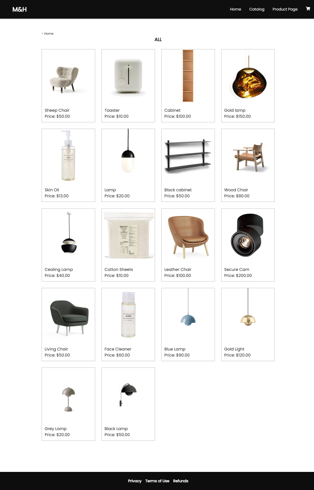
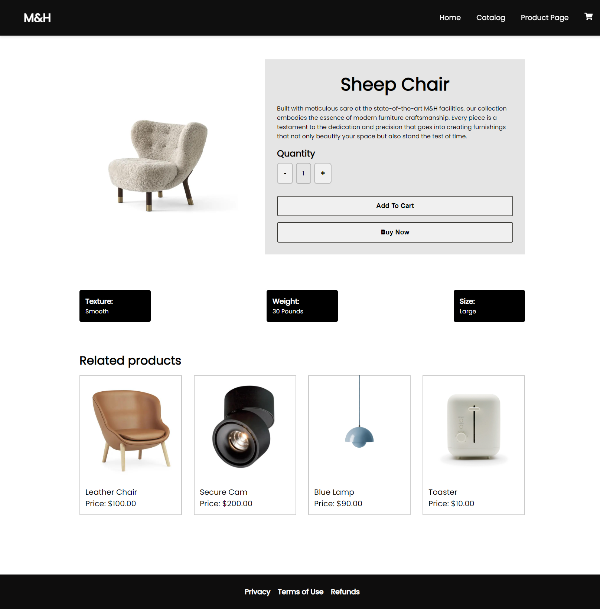

<h2>About the project</h2>

 

        <b>M&H</b> is a showcase project in my portfolio, demonstrating my proficiency in JavaScript, React, HTML, and CSS. This project introduces a touch of sophistication to the world of luxury furniture, meticulously crafted with the precision that defines M&H.
      

      

        One of the highlights of this project is the implementation of a robust cart functionality using React Context. The cart seamlessly integrates into the user interface, providing a dynamic and intuitive shopping experience. Explore the curated collection and redefine your virtual living space with furnishings that transcend the ordinary, exclusively tailored for those who appreciate the finer things in the digital world.
      

👉 Live Demo: <a href='https://m-h.vercel.app'>M&H Demo</a>

<h3>Built using:</h3>

» React JS  
» JS  
» CSS  
» HTML 

 

<h2>Project Screenshots</h2>
 
<h3 align='center'>Home Page 🏠</h3>

  

  

<h3 align='center'>Catalog Page 🎁</h3>

  

  
<h3 align='center'>Product Page 👝</h3>

  

  
